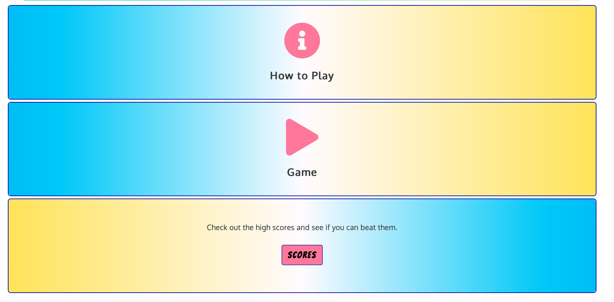
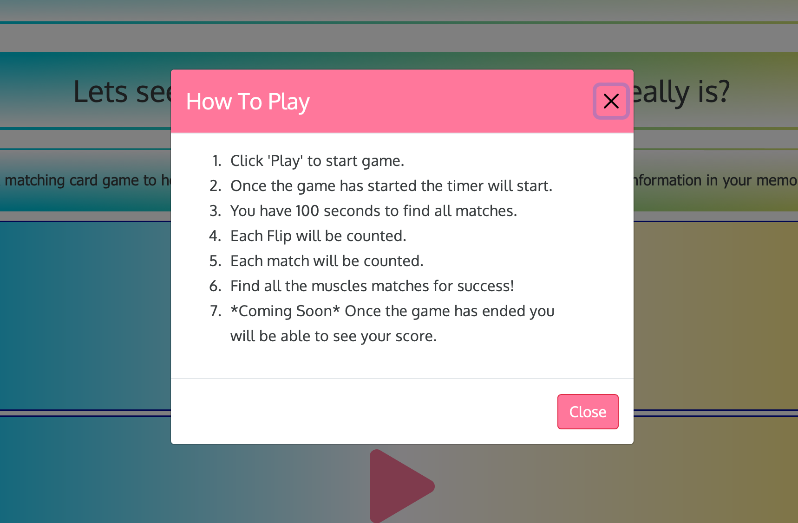

# Muscle Memory Game

(Developer: Jae Phillips)

> [Live Page](https://jusjae.github.io/CI-MS2_Muscle-Memory-Game/)

## Scope

### Project Goals

To create a site that had JavaScript interactivity.
This project is designed to help you remember the names of the muscles through playing this matching pairs memory game.

### User story

 A person who is interested in learning the locations of muscles within the human anatomy.

They would come to this website to use it as a fun way to retain knowledge on muscle anatomy through matching the images of where the muscles are found in the body.

### **First-Time Users**

#### **Tutorial or Instructions**

*   **User Story:** As a first-time user, I want to see simple instructions on how to play the game so that I can understand the rules and how to interact with the game without any confusion.
*   **Acceptance Criteria:**
    *   Instructions are visible on the main menu.
    *   Includes brief descriptions of gameplay mechanics like matching cards, game timing, and scoring.

#### **Easy Start**

*   **User Story:** As a first-time user, I want to be able to start a game quickly without needing to configure settings so that I can start playing and learning immediately.
*   **Acceptance Criteria:**
    *   A "Play" button on the main menu starts the game with default settings.
    *   The game begins within a few seconds after pressing "Play."

#### **Feedback on Actions**

*   **User Story:** As a first-time user, I want immediate feedback when I make a match or mismatch so that I can learn from my actions and understand the game dynamics.
*   **Acceptance Criteria:**
    *   Visual effects or sounds indicate right (match) or wrong (mismatch) actions.

### **Returning Users**

#### **Progress Tracking**

*   **User Story:** As a returning user, I want to see my previous scores or progress so that I can track my improvement over time.
*   **Acceptance Criteria:**
    *   The game shows a history of past scores on a scores table.
    *   Users can view details of their game performance in terms of time taken and accuracy.

#### **Difficulty Levels**

*   **User Story:** As a returning user, I want to select different difficulty levels so that I can challenge myself beyond the basic game.
*   **Acceptance Criteria:**
    *   Users can choose Easy, Normal, or Hard before starting the game.
    *   Each difficulty level adjusts the number of cards and/or the timer to provide a suitable challenge.

#### **Competitive Play**

*   **User Story:** As a returning user, I want to see how my scores compare to others so that I can gauge my learning progress and compete with friends or other users.
*   **Acceptance Criteria:**
    *   A leaderboard displays top scores from all players.
    *   Users can submit their score at the end of a game session to be ranked on the leaderboard.

## Design

### Typography

Bangers | Oxygen | Tahoma

These fonts default to sans-serif.

### Colour Scheme

 Colours planned -
 

 Colours Used -
    CSS RGBA
    --black: rgba(57, 61, 63, 1);
    --yellow: rgba(254, 228, 64, 1);
    --blue: rgba(0, 187, 249, 1);
    --pink: rgba(255, 123, 156, 1);
    --darkblue: rgba(0, 3, 165, 1);
    --off-white: rgba(255, 251, 255, 1);
    --white: rgba(255, 255, 255, 1);

I used a simple black and white base to the site with vibrant pink, yellow and blue accents .

These colours contrast very well for users who may struggle colour differentiation.
The colours also allow for s dark mode filter to easily changed the colours the user.

## Wireframes

### Mobile View

View Mobile Home Page

View Mobile Game Page

View Mobile Game - How to Play Page

View Mobile Game Difficulty Page

View Mobile High Scores Page

### Tablet view

View Tablet Home Page

View Tablet Game Page

### Web view

View Web Home Page

## Features

The page consists of four pages and nine features

### Navigation Cards

- Featured on Home Page
- The navigation cards are fully responsive and flips on touch or click and includes
links to the How to Play, Game and High Scores.
- It allows users to easily navigate the to the game, rules and high scores page.
- The user will need to click or touch the nav card to flip it over to access the information and call to action button.

View Navigation Menu Cards

### Footer

- Featured on all pages
- Consists of three separate sections: social media links and site made by credit.

View Footer

### Home

- Gives an overview of the game and a navigation menu to be able to see the rules of the game, start the game and eventually access the high scores.

### Game

- The game allows the player to click start when ready and then the timer starts and they given 100 seconds to try and match the cards showing the muscle images.

View Game

### How To Play

- The player can click on the rules option from the home page or when inthe game and be reminded of how to play the card matching game.

View How To Play

## Future Features

* High Scores Table
* Difficulty Levels

## Technologies Used

* Bootstrap v5:
    Bootstrap has been used for overall responsiveness of the website, and for the layout to include navigation, cards, and footer within the relevant sections of the website.

* Visual Studio Code/ Working Copy:
 I used Working Copy/Visual Studio Code as the IDE application with Git for version control of this project.

* GitHub:
    GitHub has been used to create a repository to host the project and receive updated commits from GitPod.

* Balsamiq:
    I used Balsamiq to create the wireframe for the website for the basic structure and layout.

* Coolors:
    This colour palette selector tool was used to see what colour would work well on the site.
  
* Google Fonts:
    The fonts were selected from and imported to style the text on the site.

* Font Awesome:
    Font Awesome was used to apply icons in the Exercises page and Footer section.

* PolyPane/Chrome/Firefox Dev Tools:
    Dev Tools were used to analyse the sites accessibility, performance, assist with debugging issues and running reports from Lighthouse/Page Speed Insights.

* W3C HTML Validation Service:
    The W3C HTML Validation Service was used as a validation tool to check for issues within the project's HTML documents code.

* W3C CSS Validation Service:
    The W3C HTML Validation Service was used as a validation tool to check for issues within the project's CSS document code.

* Web AIM Accessibility Evaluation Tool:
    This tool was used to test errors in accessibility such as the color contrast, ARIA for this project.

* Am I Responsive:
    Am I Responsive was used to create the header image for the README file to show the site in its responsive format.

* JSHint:

## Testing

Testing

[Testing](docs/testing.md)

## Deployment

The website has been deployed through Github Pages using the steps below:

1. Click on your repository Settings
2. Scroll to Pages Tab on left hand and select
3. Select source as "Branch: master"
4. Refresh page
5. Upon refresh banner states "Your site is published at <https://jusjae.github.io/CI-MS2_Muscle-Memory-Game/>"
6. Test the deployment works by clicking on link.

The following steps will guide you to clone the repository:

1. Go to the GitHub repository
2. Locate the Code button above the list of files and click it
3. Select if you prefer to clone using HTTPS, SSH, or Github CLI and click the copy button to copy the URL to your clipboard
4. Open Git Bash
5. Change the current working directory to the one where you want the cloned directory
6. Type git clone and paste the URL from the clipboard ($ git clone <https://github.com/YOUR-USERNAME/YOUR-REPOSITORY>)
7.Press Enter to create your local clone.

You can for fork the repository by following these steps:

1. Go to the GitHub repository
2. Click on Fork button in upper right hand corner

## Credits

### Game Inspiration

The inspiration for this game came from Youtuber Web Dev Simplified who created a Halloween Card Matching Game called Mix or Match, of which I then went on to adapt and build on with my code and design.

### Images & Videos

#### Icons8

Biceps - 
Triceps - 
Trapezius - 
Gastrocnemius - 
Deltoids - 
Pecs - 
Lats - 
Glutes - 
Hamstrings - 
Quadriceps - 
Muscles icon - 

## Acknowledgements

Thanks to the following people for your help and support in completing this site for the Milestone Project 2 in completion of the Web Application Developmental Diploma delivered by the Code Institute.

Slack Community
Code Institute Staff
Web Dev Simplified - Insipired the creation of Msucle Memory from Tutorial on Matching Card Game
Port Exe - Javascript support on Matching Card Game.

#ms2, #readme, #ci

